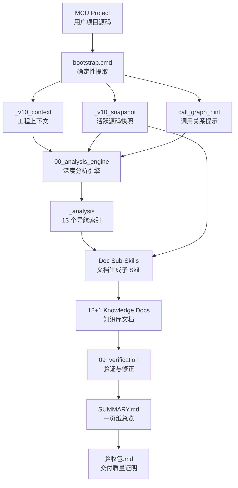

# MCU Project Organizer V13

<div align="center">

# MCU 项目知识库构建引擎 V13

**Source-First Knowledge Builder for MCU Projects**  
**面向 MCU 老项目的源码优先知识库构建 Skill**


**原创作者公众号：欧工AI**  
**微信：603311638**

</div>

---

## What It Does / 它是做什么的

**EN**  
`mcu-project-organizer-v13` is a knowledge-base builder for MCU projects.  
It extracts build context, snapshots active source files, asks AI to read the source directly, and produces a structured project knowledge base for both humans and QA assistants.

**中文**  
`mcu-project-organizer-v13` 是一个面向 MCU 项目的知识库构建 Skill。  
它不是简单总结代码，而是先确定性提取工程上下文，再让 AI 直接读源码，最后生成一套可交付、可追问、可验收的项目知识库。

它适合处理：

- Keil / IAR 风格的 MCU 老项目
- 缺少文档、交接困难的嵌入式项目
- 需要新人快速接手的固件工程
- 需要沉淀协议、参数、时序、模块职责的项目
- 需要后续接入 `mcu-qa-assistant` 做项目问答的知识包

---

## Why It Feels Strong / 为什么它会显得很强

**EN**  
Because V13 does not trust a thin summary as the final truth.  
The `_analysis/` layer is only a navigation index. Final documents must go back to the source snapshot and extract exact facts.

**中文**  
因为 V13 的核心不是“让模型凭感觉写文档”，而是把项目整理拆成一条更稳的链路：

- 先用脚本提取工程真实上下文
- 再建立 `_analysis/` 导航索引
- 再让每个文档子 Skill 直接回读源码
- 最后用验证器和验收包把质量兜住

这就是它比普通“代码总结”更稳的原因。

---

## Build Philosophy / 构建哲学

### The Core Rule / 核心规则

> `_analysis/` is an index, not the source of truth.  
> `_analysis/` 只是导航索引，不是最终事实来源。

最终知识库必须以当前项目源码为准，尤其是：

- 宏定义、条件编译、芯片型号
- GPIO、外设、时钟、NVIC 配置
- 协议帧、状态机、任务链路
- 硬编码参数、阈值、超时、默认值
- 模块职责、调用关系、数据结构

---

## Architecture / 架构图



---

## Output Documents / 产物清单

V13 默认生成 12 个主体文档、1 个 `SUMMARY.md`，并在交付前生成 `验收包.md`。

| 输出文件 | 用途 |
|---|---|
| `00_阅读指南.md` | 告诉新人如何读这套知识库 |
| `01_项目介绍.md` | 项目目标、芯片、目录、整体认知 |
| `02_硬件配置.md` | GPIO、时钟、外设、NVIC 等硬件事实 |
| `03_系统架构.md` | 启动流程、任务结构、模块关系 |
| `04_功能模块.md` | 模块职责、入口函数、核心逻辑 |
| `05_通信协议.md` | 帧格式、命令、状态、收发链路 |
| `06_关键参数表.md` | 阈值、周期、超时、默认值、硬编码参数 |
| `07_已知问题与建议.md` | 风险、冲突、潜在 Bug、改造建议 |
| `08_数据流与控制流.md` | 数据从输入到输出的完整链路 |
| `09_项目结构总览.md` | 新人接手视角的工程地图 |
| `10_代码语义化.md` | 关键函数、变量、结构体的语义解释 |
| `11_常见问题清单.md` | 可直接用于问答的 FAQ |
| `SUMMARY.md` | 一页纸总览、架构图、风险摘要 |
| `12_历史经验库.md` | 可选，承接聊天记录、口述经验、Word 文档 |
| `验收包.md` | 交付前质量验证和客户盲测入口 |

---

## Pipeline / 执行流程


### In Plain Language / 用人话解释

1. 先运行 `bootstrap.cmd`，把项目上下文和源码快照提取出来。
2. 再执行 `sub-skills/00_analysis_engine.md`，生成 `_analysis/` 导航索引。
3. 按顺序执行文档子 Skill，生成 00-11 的知识库文档。
4. 执行 `sub-skills/09_verification.md` 做验证和修正。
5. 执行 `sub-skills/13_doc_summary.md` 生成 `SUMMARY.md`。
6. 交付前执行 `sub-skills/15_verification_package.md` 生成 `验收包.md`。

---

## Quick Start / 快速开始

### Step 1 / 第一步

双击或命令行运行：

```bat
bootstrap.cmd "E:\path\to\project" "E:\path\to\knowledge_base"
```

### Step 2 / 第二步

对 AI 说：

```text
请读取 SKILL.md，
对 E:\path\to\knowledge_base 执行 mcu-project-organizer-v13 完整知识库构建流程。
```

### Single Document Enrichment / 单文档补厚

如果只想补厚某个文档，可以说：

```text
请读取 sub-skills/05_doc_protocols.md，
补厚这个知识库里的 05_通信协议.md，要求直接回读源码，不覆盖已有内容。
```

### Rebuild Analysis Index / 重建分析索引

源码有较大更新时，可以说：

```text
请读取 sub-skills/00_analysis_engine.md，
重新分析这个知识库，刷新 _analysis/ 索引。
```

---

## Modes / 两种工作模式

### Pipeline Mode / 流水线模式

适合第一次整理项目。  
从 `bootstrap.cmd` 开始，按固定顺序生成完整知识库、验证报告、`SUMMARY.md` 和验收包。

### Enrichment Mode / 单独补厚模式

适合交付后迭代。  
只重跑某一个子 Skill，例如只补协议、只补参数表、只补模块文档。V13 的铁律要求补厚时保留已有内容，并追加缺失事实。

---

## Read Order / 必读顺序

完整构建时，按这个顺序读文件：

1. `SKILL.md`
2. `sub-skills/00_analysis_engine.md`
3. `sub-skills/01_doc_overview.md`
4. `sub-skills/02_doc_hardware.md`
5. `sub-skills/03_doc_architecture.md`
6. `sub-skills/04_doc_modules.md`
7. `sub-skills/05_doc_protocols.md`
8. `sub-skills/06_doc_params.md`
9. `sub-skills/07_doc_issues.md`
10. `sub-skills/08_doc_dataflow.md`
11. `sub-skills/10_doc_newcomer.md`
12. `sub-skills/11_doc_semantics.md`
13. `sub-skills/12_doc_faq.md`
14. `sub-skills/09_verification.md`
15. `sub-skills/13_doc_summary.md`
16. `sub-skills/15_verification_package.md`

按需补充：

- `sub-skills/14_doc_experience.md`：用户主动投喂历史经验时使用
- `shared/iron_rules.md`：所有子 Skill 的硬规则
- `shared/format_spec.md`：文档排版规范
- `shared/quality_checklist.md`：验证检查清单
- `shared/anchor-questions.md`：验收包锚点题

---

## File Structure / 文件结构

```text
mcu-project-organizer-v13/
├── SKILL.md
├── README.md
├── bootstrap.cmd
├── scripts/
│   ├── 00_common.ps1
│   ├── 01_extract_project_context.ps1
│   ├── 02_export_source_snapshot.ps1
│   ├── 03_build_call_graph_hint.ps1
│   └── verify_output.py
├── shared/
│   ├── anchor-questions.md
│   ├── credibility_standard.md
│   ├── format_spec.md
│   ├── iron_rules.md
│   └── quality_checklist.md
└── sub-skills/
    ├── 00_analysis_engine.md
    ├── 01_doc_overview.md
    ├── 02_doc_hardware.md
    ├── 03_doc_architecture.md
    ├── 04_doc_modules.md
    ├── 05_doc_protocols.md
    ├── 06_doc_params.md
    ├── 07_doc_issues.md
    ├── 08_doc_dataflow.md
    ├── 09_verification.md
    ├── 10_doc_newcomer.md
    ├── 11_doc_semantics.md
    ├── 12_doc_faq.md
    ├── 13_doc_summary.md
    ├── 14_doc_experience.md
    └── 15_verification_package.md
```

---

## Hard Rules / 硬规则

1. 代码即事实，不能用猜测替代源码证据。
2. `_analysis/` 只能作为导航索引，最终文档必须回读 `_v10_snapshot/`。
3. 宏定义、条件编译、芯片型号必须按当前目标解析。
4. 补厚已有文档时，只追加和修正，不粗暴覆盖。
5. 数值、协议、引脚、时钟、参数必须尽量给出来源位置。
6. 验证阶段不可跳过，交付前必须生成验收包。
7. 不确定的结论必须标注不确定，不能包装成事实。

---

## Success Standard / 成功标准

这个 Skill 用得正确时，应该做到：

- 新人能靠 00-11 文档理解项目结构和关键链路
- QA Assistant 能基于文档回答参数、协议、流程、调试问题
- 每个关键结论都能回到源码或生成过程证据
- 交付前有 `验收包.md` 支撑客户验收
- 项目后续变化时，可以单独补厚某个文档，而不是重写整套知识库

---

## Best Pairing / 最佳搭配

**EN**  
This skill pairs naturally with `mcu-qa-assistant-v5` or newer MCU QA assistants.  
Organizer builds the knowledge base; QA Assistant consumes it with evidence-first answering.

**中文**  
这个 Skill 与 MCU QA 系列是天然搭配：

- `mcu-project-organizer-v13` 负责“把项目整理透”
- `mcu-qa-assistant` 负责“把知识用起来”

